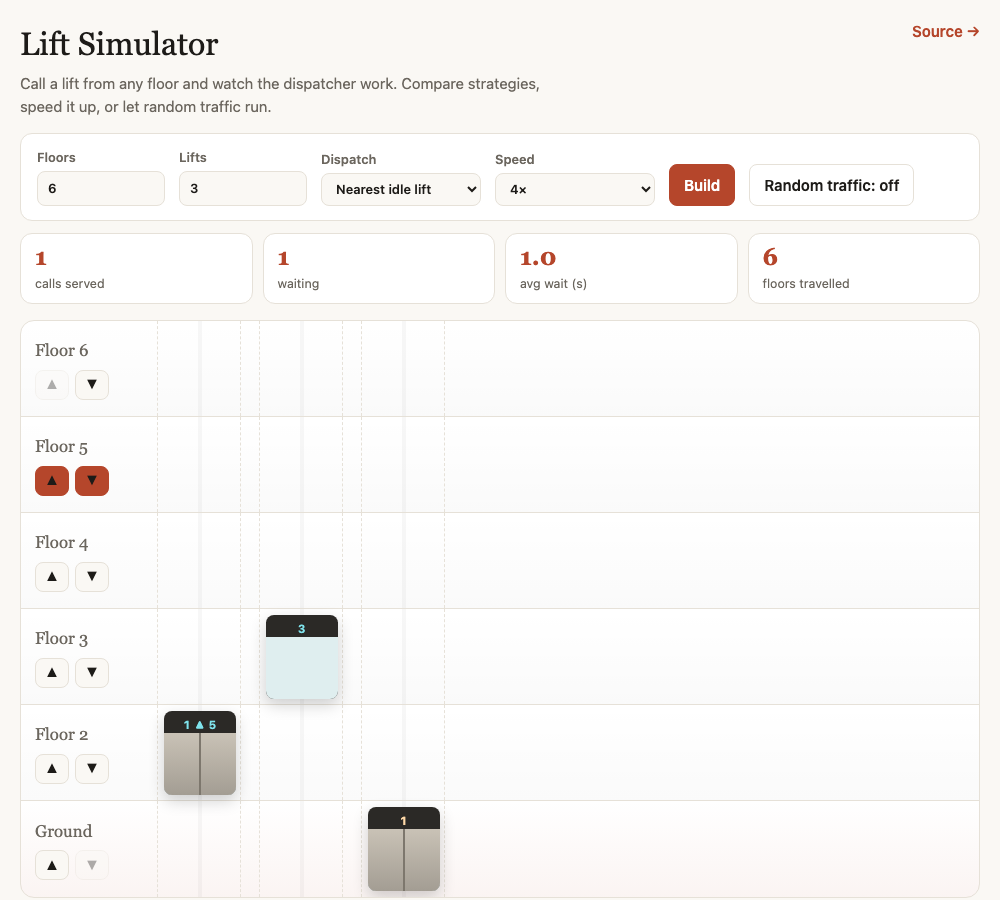

# Lift Simulator

A browser simulation of a building with multiple lifts. Choose how many floors (1–15) and lifts (1–4), call a lift from any floor, and watch the dispatcher assign one: it travels there at a speed proportional to the distance, opens its doors, closes them, and becomes available again. Calls made while every lift is busy queue up and are served in order.

Plain **HTML, CSS and JavaScript** — no frameworks, no build step, no dependencies.

**▶ Live demo: <https://lagnis337.github.io/Lift_Simulator/>**



## What you can do

- **Call lifts** with the ▲ / ▼ buttons on each floor. A button lights up while its call is pending and clears when a lift arrives.
- **Compare dispatch strategies** — *nearest idle lift* (default) or *first idle lift* — and watch the "floors travelled" counter to see the difference.
- **Change speed** (1×, 2×, 4×) without changing the simulation's logic.
- **Random traffic** — toggle it on and the building generates calls on its own; watch the queue and the average wait.
- **Stats** — calls served, calls waiting, average wait in seconds, total floors travelled.

Each lift cabin shows its current floor and, while moving, its destination and direction.

## Running it

Open <https://lagnis337.github.io/Lift_Simulator/>, or clone the repo and open `index.html` in a browser.

```bash
git clone https://github.com/lagnis337/Lift_Simulator.git
cd Lift_Simulator
open index.html          # macOS; on Linux use xdg-open, on Windows double-click the file
```

## How it works

| File         | Purpose                                                                 |
|--------------|-------------------------------------------------------------------------|
| `index.html` | Controls, stats bar, and the container the building is rendered into    |
| `app.js`     | Builds the floors and lifts in the DOM; dispatch, movement, queue, stats |
| `styles.css` | Building facade, cabins, doors, buttons, responsive layout              |

**Rendering.** On build, floors are created top-down so floor 1 sits at the bottom; every floor row has one shaft per lift, and the lift cabins live in the ground-floor shafts and move by CSS `transform: translateY(...)`. Floor height is read from a CSS variable so the layout and the movement can't drift apart.

**Calls.** A floor's call is recorded with the time it was made (for the wait statistic) and lights the buttons. A call is ignored if the floor already has one pending or an idle lift is already sitting there.

**Dispatch.** Among idle lifts, *first idle* picks the lowest-numbered one; *nearest idle* picks the one with the smallest floor distance. If no lift is idle, the call goes onto a queue, served in order whenever a lift finishes its door cycle.

**Movement.** Travel time is `|target − current| × 2 s ÷ speed`, applied as the CSS transition duration; three timers then open the doors on arrival, close them after a dwell, and free the lift for the next call. The cabin display is updated at each step.

## Limitations / what I'd do next

- **Direction-aware dispatch.** ▲ and ▼ currently behave identically; a real controller batches calls going the same way and picks up passengers en route.
- **Destination requests.** Passengers only *call* a lift; there's no "go to floor N" once inside.
- **Timers vs. events.** Movement timing is driven by `setTimeout` rather than `transitionend`, so it would drift if the CSS durations changed independently.
- **Fairness.** The queue is FIFO; long-waiting calls on far floors could starve under heavy random traffic — visible in the average-wait stat.
